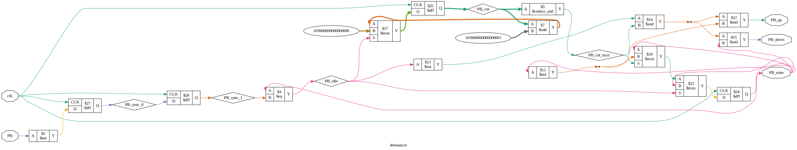
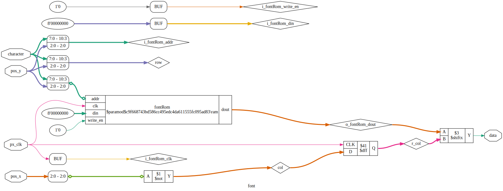
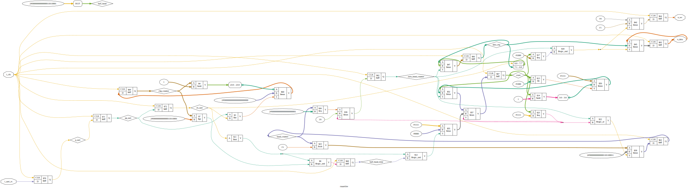
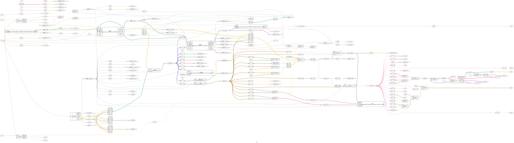
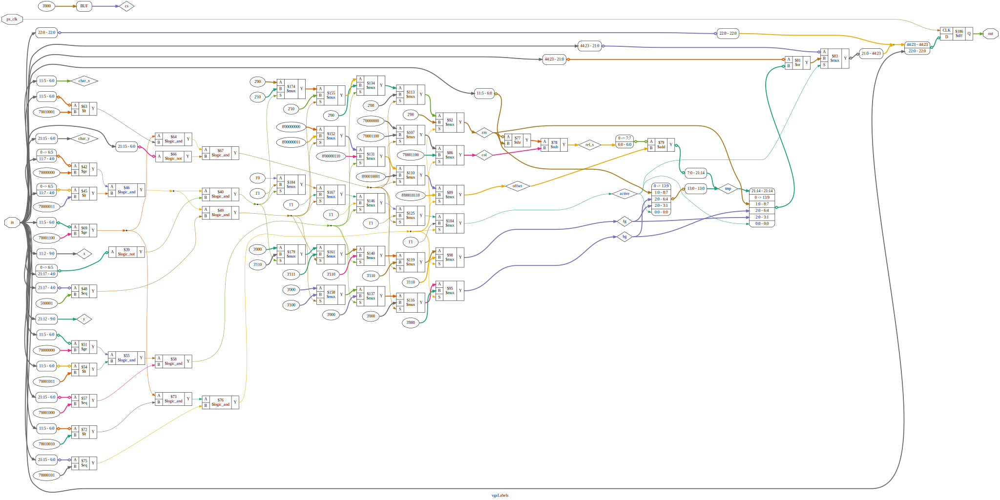

# Diagrams

- [debouncer](#debouncer)
- [font](#font)
- [hex2asc](#hex2asc)
- [ram](#ram)
- [register](#register)
- [rxuartlite](#rxuartlite)
- [top](#top)
- [txuartlite](#txuartlite)
- [ufifo](#ufifo)
- [vgaLabels](#vgaLabels)
- [vgaModulesPipe](#vgaModulesPipe)
- [vgaWord](#vgaWord)
- [vga_sync](#vga_sync)

# debouncer

# font

# hex2asc

# ram

# register

# rxuartlite

# top

# txuartlite

# ufifo

# vgaLabels

# vgaModulesPipe

# vgaWord

# vga_sync

